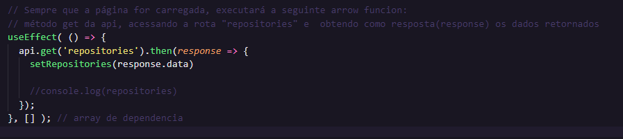
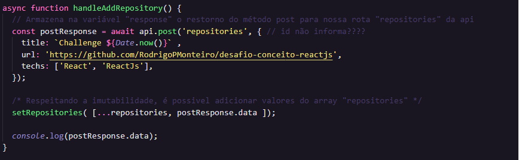
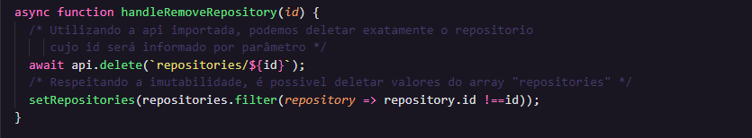
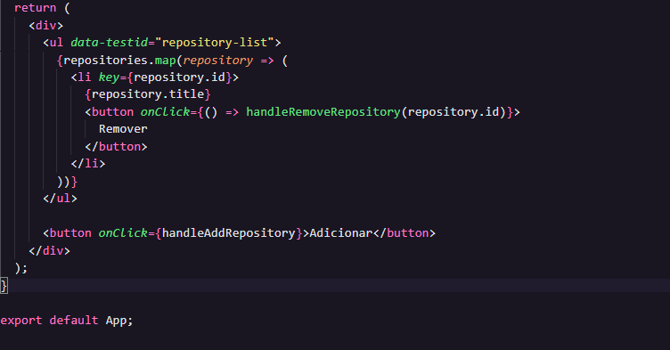
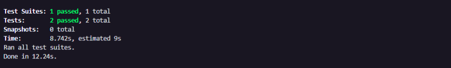
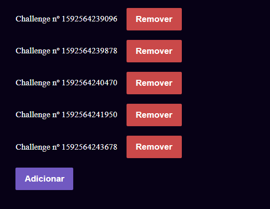
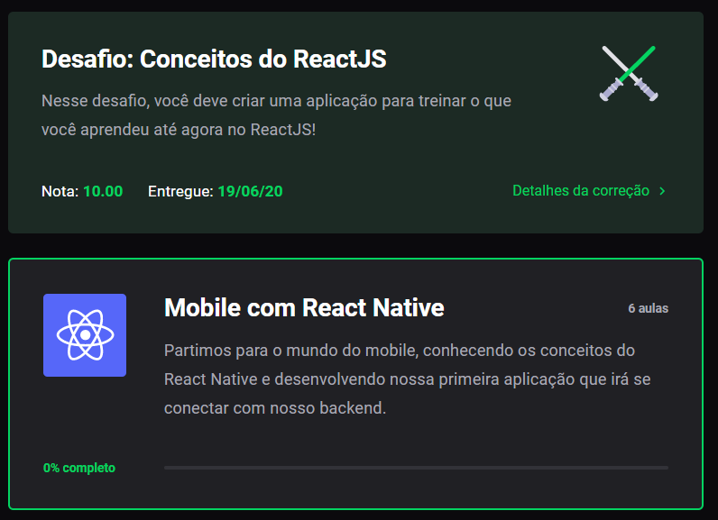

# Desafio: Conceitos do ReactJS
Repositório criado para desenvolvimento do desafio: Conceitos do ReactJs

<h3 align="center">
  Desafio 03: Conceitos do ReactJS
</h3>

<blockquote align="center">“Faça seu melhor, mas sempre com prazo de entrega”!</blockquote>

  

## :rocket: Sobre o desafio

Nesse desafio, será criada uma aplicação para treinar o que foi aprendido até agora no ReactJS!

Continuaremos desenvolvendo a aplicação que irá armazenar repositórios, a qual já desenvolvemos o backend no último desafio utilizando o Node.js.
O desafio pode ser visualizado no link: 
 **[GitHub - Desafio NodeJs](https://github.com/RodrigoPMonteiro/desafio-conceitos-nodejs)**

### Template da aplicação

Para te ajudar nesse desafio, foi gerado pela RocketSeat o modelo que utilizamos como um template do Github.

O template está disponível na seguinte url: **[Acessar Template](https://github.com/Rocketseat/gostack-template-conceitos-reactjs)**

**Dica**: Caso não saiba utilizar repositórios do Github como template, existe um guia em **[nosso FAQ](https://github.com/Rocketseat/bootcamp-gostack-desafios/tree/master/faq-desafios).**

Agora navegue até a pasta criada e abra no Visual Studio Code, execute o comando `yarn` no seu terminal para instalar todas as dependências e já estará pronto para iniciar.

### Funcionalidades da aplicação

Agora que você já está com o template clonado, e pronto para continuar, você deve abrir o arquivo **src/App.js**, e completar onde não possui código com o código para atingir os objetivos de cada funcionalidade.

- **`Listar os repositórios da sua API`**: Deve ser capaz de criar uma lista com o campo **title** de todos os repositórios que estão cadastrados na sua API.

  

- **`Adicionar um repositório a sua API`**: Deve ser capaz de adicionar um novo item na sua API através de um botão com o texto **Adicionar** e, após a criação, deve ser capaz de exibir o nome dele após o cadastro.

  

- **`Remover um repositório da sua API`**: Para cada item da sua lista, deve possuir um botão com o texto **Remover** que, ao clicar, irá chamar uma função para remover esse item da lista do seu frontend e da sua API.

  

O Html será gerado no JS da seguinte maneira:

  

Ao final, o return exibirá a "LI" com o botão Remover ao lado do nome do repositório e o botão Adicionar logo abaixo.

Após executar o <I>yarn test</I> será exibida a mensagem abaixo:

  

### Dificuldades encontradas no desafio:

A maior dificuldade encontrada neste desafio foi que o jest apontava erro, mesmo quando os métodos get e post já estavam corretos. O validador só marcou como "sucesso" quando os 3 métodos( get, post e delete) estavam ok.
Tal cenário gerou dúvidas sobre em qual parte do código apresentava erro.

Como dica, ao observar o "package.json" observei que poderia executar o front-end com o comando:

<li>
  <i>yarn start</i>
</li> 

Ao executar a primeira vez, observei que o botão "Adicionar" não obtinha resposta pois meu server em nodejs não estava executando.  
Naveguei até o diretório e executei o comando:

<li>
  <i>yarn dev</i>
</li> 

Pronto! Consegui testar os métodos get, post e delete separadamente, facilitando a localização dos erros.

  
   Front-end em execução e interagindo com o Back-end!

### Específicação dos testes

Em cada teste há uma breve descrição do que a aplicação deve cumprir para que o teste seja aprovado.

Caso existam dúvidas quanto ao que são os testes, e como interpretá-los, é possível acessar a documentação em **[nosso FAQ](https://github.com/Rocketseat/bootcamp-gostack-desafios/tree/master/faq-desafios).**

Para esse desafio os testes são os seguintes:

- **`should be able to add new repository`**: Para que esse teste passe, sua aplicação deve permitir que um repositório seja adicionado ao seu backend e listado no seu frontend dentro de uma `LI`.

- **`should be able to remove repository`**: Para que esse teste passe, sua aplicação deve permitir que ao clicar no botão de remover que vai estar dentro da `LI` do repositório adicionado, o item seja removido da listagem.

### Entrega

Esse desafio será entregue a partir da plataforma Skylab, através do envio do link do repositório. Após concluir o desafio, é primordial a criação de um post no Linkedin e a postagem do código do Github visando demonstrar os conhecimentos e esforços para evolução na sua carreira e/ou para oportunidades futuras.

Após envio, o componente do Desafio será atualizado com a nota e com a informação de aprovação, conforme abaixo:

  

## :memo: Licença

Esse projeto está sob a licença MIT. Veja o arquivo [LICENSE](LICENSE) para mais detalhes.

---

Feito com 💜 by RodrigoMonteiro :wave: [Entre na comunidade do Discord!](https://discordapp.com/invite/gCRAFhc)
